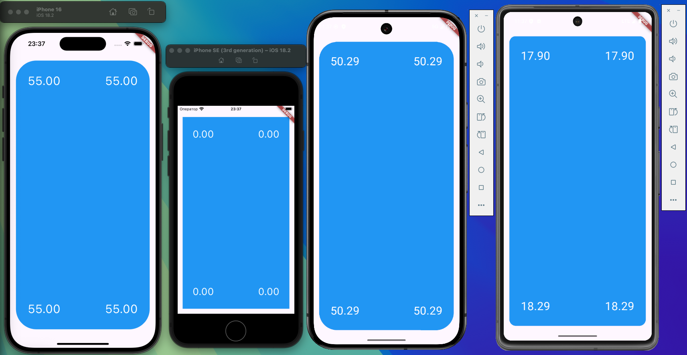

# Screen Corner Radius
Plugin provides corner radius value of current device screen.
Works for iOS and Android.

<div align="center">

  <a href=""></a>
  <a href=""></a>
  <a href="https://opensource.org/licenses/MIT"></a>

</div>

<div align="center">
  <a href="https://www.buymeacoffee.com/ivangalkin" target="_blank"></a>
</div>



## Usage
1) Import the package:
```dart
import 'package:screen_corner_radius/screen_corner_radius.dart';
```
2) Use the method:
```dart
final ScreenRadius? screenRadius = await ScreenCornerRadius.get();
```
The return value is data class ScreenRadius, which can be used immediately in the widget layout.

## Android
The rounded corners [API](https://developer.android.com/about/versions/12/features?hl=ru#rounded_corner_apis) with the [getRoundedCorner](https://developer.android.com/reference/android/view/WindowInsets?hl=en#getRoundedCorner(int)) method is used to determine screen radii.

## iOS
The [UIScreen](https://developer.apple.com/documentation/uikit/uiscreen) object extension with the _displayCornerRadius key parameter is used to determine screen radius.

## Acknowledgments
The problem was mostly that such a plugin had not been released to Pub yet.
A huge thanks to users [@kylebshr](https://github.com/kylebshr) and [@rehmatsg](https://github.com/rehmatsg) for the [ScreenCorners](https://github.com/kylebshr/ScreenCorners) resources and the [device_corner_radius](https://github.com/rehmatsg/device_corner_radius) package to put together the logic for iOS and Android platforms.

## Additional information
For more details see example project. And feel free to open an issue if you find any bugs or errors or suggestions.